# AI Exam Intelligence — Phase A & B

Local, scalable foundation for the exam prediction platform.

**Phase A:** PDF ingestion with PyMuPDF, preserving page boundaries.

**Phase B:** deterministic extraction of sections, questions, subquestions, question marks and subquestion marks into Pydantic models and JSON.

## Run

```bash
python -m venv .venv
# Windows: .venv\\Scripts\\activate
# Linux/macOS: source .venv/bin/activate
pip install -r requirements.txt
python -m app.cli --input data/raw/amity_adms_2018.pdf
```

Folder input:

```bash
python -m app.cli --input data/raw --output data/processed
```

## Structure

```text
app/
  ingestion/       # Phase A
  extraction/      # Phase B
  models/          # stable domain contracts
  utils/
data/
  raw/
  processed/
tests/
docs/
config/
```

The supplied Amity sample PDF is included under `data/raw/` as a test fixture.

## Architecture

```mermaid
flowchart LR
    PDF[PDF] --> ING[PDF Ingestion]
    ING --> TEXT[Page Text]
    TEXT --> CLEAN[Text Normalization]
    CLEAN --> SEC[Section Detection]
    SEC --> Q[Question Detection]
    Q --> SUB[Sub-question Detection]
    SUB --> M[Marks Extraction]
    M --> MODEL[Pydantic Domain Model]
    MODEL --> JSON[Processed JSON]
```



## Next phases

Add `validation/`, `metadata/`, `embeddings/`, `clustering/`, `syllabus/`, `prediction/`, and `api/` as separate modules. Keep Phase A/B interfaces stable.
